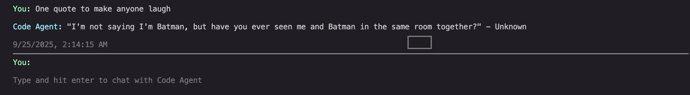

# Code Agent [Last updated 29th September 2025]
Agentic system for intelligent code assistance



## Current Features (Implemented)

☑️ **Interactive CLI Interface** - React-based terminal UI with real-time chat

☑️ **Session Management** - Conversation history and message persistence

☑️ **Multi-LLM Provider Support** - OpenRouter and AWS Bedrock integration

☑️ **Provider Switching** - LLM provider selection

☑️ **TypeScript Monorepo** - Well-structured packages (cli, core, services, types, utils, tools)

☑️ **Message timestamps** - Conversation flow with timestamps and metadata


## Installation & Usage

```bash
# Clone and install
git clone https://github.com/0ne0rZer0/code-agent.git
cd code-agent
npm install

# Development
npm run dev          # Watch mode compilation
npm run build        # Full build
npm run start        # Build and run CLI

# Package-specific commands
npm run start:cli    # Run CLI directly
npm run clean        # Clean build artifacts
```

## Project Structure

```
packages/
├── cli/             # Interactive terminal interface
├── core/            # Session management and orchestration
├── services/        # LLM provider integrations
├── types/           # Shared TypeScript definitions
├── utils/           # Common utilities and helpers
└── tools/           # Tool execution framework
```

## Architecture

The system follows a modular architecture with clear separation of concerns:

- **CLI Layer** - User interface and input handling
- **Core Layer** - Business logic and session management
- **Services Layer** - External API integrations
- **Types Layer** - Shared data models and interfaces